# Nexus Synapse — Public Process Architecture

> **The model is not the system. The runtime is a process.**

This page is the public-safe navigation point for the Nexus Synapse process-architecture release set.

The diagrams describe **how Nexus performs work**: receiving, analysis, context kitting, deterministic state reconstruction, inference dispatch, governed tool execution, inspection, transaction close, and asynchronous continuity work.

They do **not** publish the private runtime implementation. Exact thresholds, formulas, SQL, private SSR ranking/eligibility logic, gauge math, prompt/preprompt text, credentials, sensitive schemas, and other implementation-specific tolerances remain private.

## Start with Request Watch

<p align="center">
  <a href="https://chriscanadian.github.io/nexus-synapse-engineering-portfolio/">
    
  </a>
</p>

<p align="center"><strong>Request Watch v0.6</strong> — click the animation for the live GitHub Pages version.</p>

Request Watch is an explanatory presentation artifact. Its dwell/transition timing is illustrative, not live runtime takt. In v0.6, the moving token is the WIP unit: the next station does not light up, and the lower detail/governance panels do not switch, until the token arrives.

## The three process views

| View | Purpose | Open |
|---|---|---|
| **Request Watch v0.6** | Presentation-scale view of a request moving through the top-level runtime stations while active responsibilities and Governance / Quality controls light up | [Live GitHub Pages](https://chriscanadian.github.io/nexus-synapse-engineering-portfolio/) |
| **Master Process Map v0.7** | Full public-safe topology with workcells, equipment, material/state, governing controls, inspection gates, evidence tiers, WIP, custody, forks/joins, fallbacks and rework | [SVG](../https://chriscanadian.github.io/nexus-synapse-engineering-portfolio/master-process-map-v0.7.html) · [Interactive HTML](../https://chriscanadian.github.io/nexus-synapse-engineering-portfolio/master-process-map-v0.7.html) |
| **Value Stream v0.2** | Compact Lean/process view of the governed turn, transaction close, WIP/outbox and async support lane | [SVG](../process-architecture/diagrams/value-stream-v0.2.svg) |

## ISO-style process library

The public Process Library follows the same basic navigation pattern as a controlled work-instruction system: a high-level **Scope / Process Index** points into the individual process instructions.

**[000 — Governed Turn — Scope & Process Index](../process-architecture/processes/000-GOVERNED-TURN.md)**

```text
Receiving & Trust Boundary
        ↓
Analysis & Inspection
        ↓
Context Acquisition & Kitting
        ↓
SSR & Context Assembly
        ↓
Forklift & Inference Dispatch
        ↓
Tool Workcell & Proof
        ↓
Final Inspection & Delivery
        ↓
Transaction Close & Async Continuity
```

Each process WI links to its upstream/downstream process and applicable controlled artifact family.

**[Open the canonical GitHub process binder](../process-architecture/README.md)**

## Governing controlled artifacts

Material decisions are associated with a public-safe `CTRL-*` control family, for example:

- `CTRL-100` — Trust / Scope Release
- `CTRL-200` — Analysis Quality
- `CTRL-300` — Context Eligibility / Scope
- `CTRL-400` — Context Release
- `CTRL-500` — Provider Route Control
- `CTRL-600` — Tool Authorization
- `CTRL-610` — Artifact Verification
- `CTRL-700` — Response Release
- `CTRL-800` — Transaction / Async Control

See the **[Control Register](../process-architecture/controls/CONTROL_REGISTER.md)**.

The documentation can identify the governing control family today. **V5 is not yet claimed to bind every runtime PASS/FAIL receipt to the exact `control_id + approved_revision`.** That remains an explicit traceability requirement until implemented and acceptance-tested.

## Evidence status is part of the map

The Monster itself is documentation/navigation evidence, not automatic proof that every process is active or durable. v0.6 therefore carries evidence-tier badges rather than forcing a reader to guess:

- **CURRENT-PROD PATTERN** — responsibility family/process shape reconciled against the current production parity source.
- **V5 CODE-BACKED** — the responsibility family exists in the pinned V5 reconstruction snapshot.
- **V5 ACCEPTANCE-TESTED** — the pinned V5 snapshot has green behavioral/failure/container/contract evidence.
- **V5 HARDENING** — V5 adds an explicit guard, receipt, recovery path, authority boundary or failure treatment beyond the production parity shape.
- **V5 STAGING ACTIVATED** — separate operational claim; code/test evidence does not imply production activation or sustained durability; a separate accepted V5 staging release now exists.
- **TRACEABILITY GAP** — governing control family is identifiable, but exact approved-revision binding in every decision receipt is not yet claimed.

See **[Process Architecture Evidence Status](../process-architecture/EVIDENCE_STATUS.md)** for the pinned source revisions and claim ceiling.

## Process notation

The master map uses visual distinctions only where they correspond to a real architectural distinction:

- **Responsibility / workcell** — owns a transformation, decision, authorization, inspection, or domain meaning.
- **Equipment / dependency** — performs computation for a responsibility without owning runtime authority. Examples include Stanza, BART, DistilRoBERTa, VADER, MiniLM, provider adapters, and LLMs where applicable.
- **Material / state handoff** — structured work product moving between responsibilities.
- **Governing controlled artifact** — versioned requirement/control family governing a material decision family.
- **Inspection / release gate** — decides whether work may proceed, degrade, retry, fail, or enter bounded rework.
- **Queue / WIP** — durable work that exists but may not yet be processing.
- **Persistent custody** — canonical runtime state.
- **Artifact custody** — binary/document/image artifact storage distinct from canonical structured state.
- **Candidate / proposal boundary** — advisory/inferred work that cannot silently mutate protected state.
- **Solid steel flow** — ordinary synchronous/control dependency.
- **Thick solid green branch** — `YES` answer to the decision diamond.
- **Thin dashed red branch** — `NO` answer to the decision diamond.
- **Dashed steel flow** — asynchronous, advisory, derivative, or non-blocking handoff as labelled.
- **Fork / join** — real parallel fan-out/fan-in.
- **Rework / re-entry** — bounded retry, correction, or continued tool execution.

Branch color answers the question in the diamond; green does **not** universally mean a successful business outcome.

## One system, not a diagrammatic hybrid

These artifacts depict **V5 as the one target Nexus runtime**.

Current production is used as the behavioral/parity source. The production process shape has already carried real traffic; V5 reconstructs the same responsibility pattern behind clearer contracts and adds approved hardening. If a production responsibility intended to survive is absent from V5, it is a **V5 parity gap**, not permission to silently blend two runtimes together.

Likewise, logical state ownership does not imply a separate physical database per subsystem. The process map uses one canonical Nexus durable-state boundary, with separate derived indexes or artifact/object custody only where those storage responsibilities are actually distinct.

## Canonical public / private release discipline

The process architecture now has a controlled publication chain:

```text
PRIVATE CONTROLLED WORKING SOURCE
        ↓
work · reconcile · review
        ↓
approved PUBLIC-SAFE revision
        ↓
CANONICAL PUBLIC GITHUB RECORD
        ↓
GitHub Pages / README / distribution copies
```

- **GitHub** is the canonical approved public record because commits, diffs and exact revisions are addressable.
- **GitHub Pages** is the executable presentation layer for Request Watch and future interactive public views.
- **Google Drive** remains useful for private working copies, controlled binder material, playback/distribution copies, and backup. It is not the canonical public process specification.

`PUBLIC-SAFE` describes what an artifact is safe to disclose. `PUBLIC` describes whether a particular copy is actually accessible.

## Reconciliation

Public Nexus documentation follows the **[Reconciliation and Publication Control](RECONCILIATION_CONTROL.md)**. The current pinned cross-repository snapshot is in **[Current Public Snapshot](CURRENT_PUBLIC_SNAPSHOT.md)**.

---

For current evidence labels and claim ceilings, see the [Engineering Portfolio README](../README.md), [Production Evidence Status](PRODUCTION_EVIDENCE_STATUS.md), [Process Architecture Evidence Status](../process-architecture/EVIDENCE_STATUS.md), and [Public Technical Reference](reference/NEXUS_PUBLIC_TECHNICAL_REFERENCE_v1_1.md).
